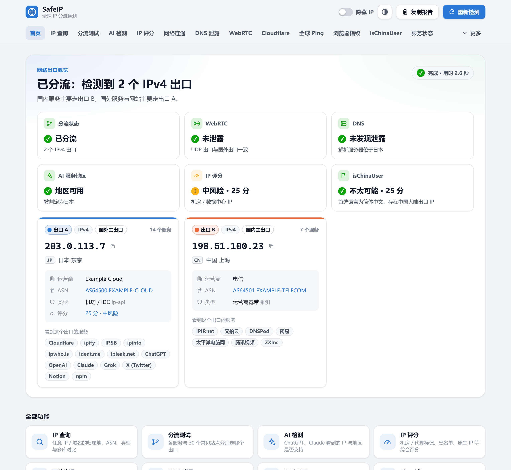
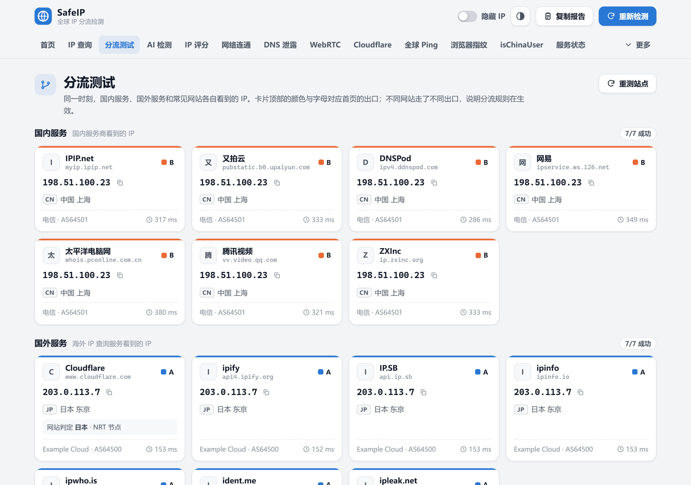
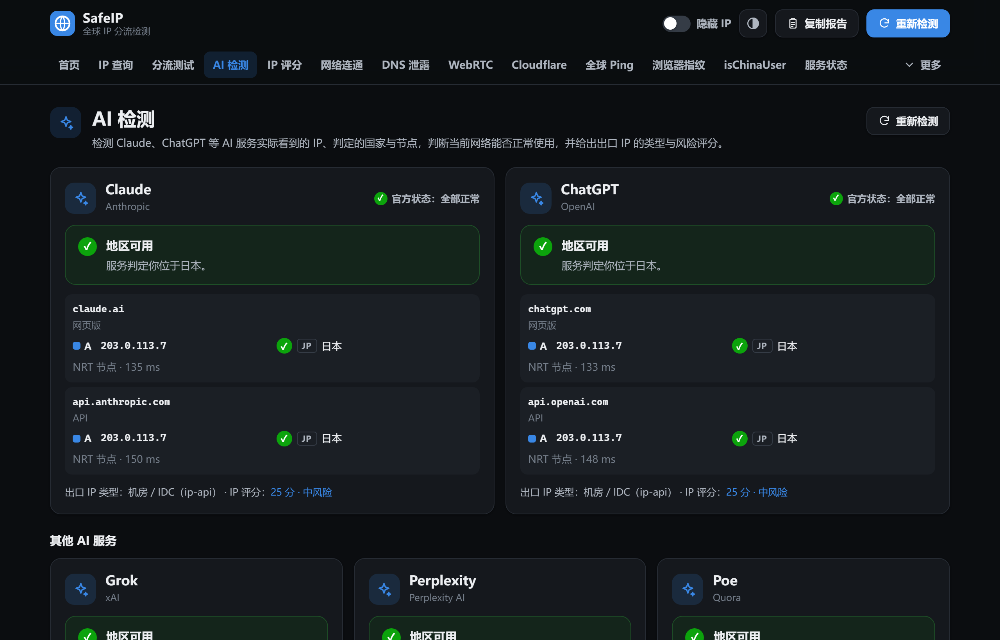
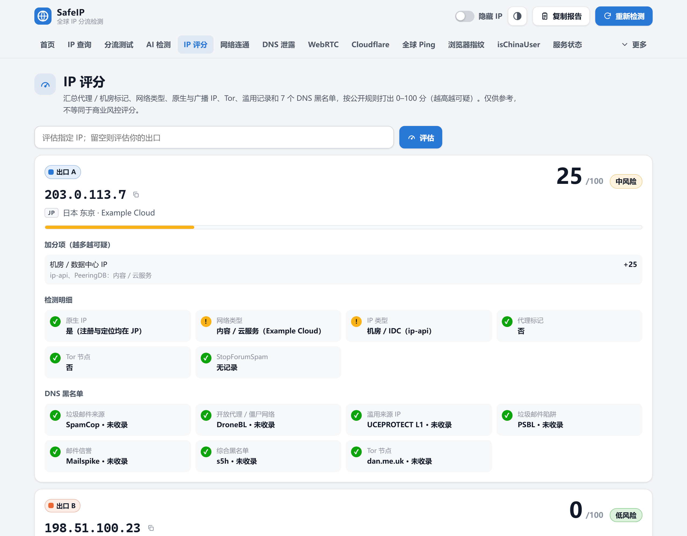
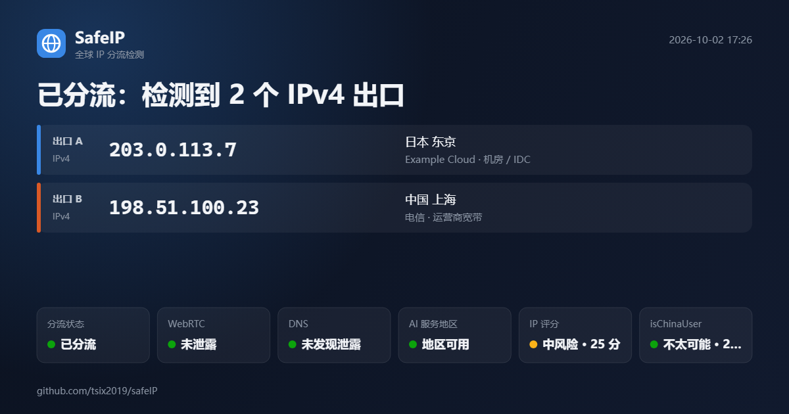

<div align="center">

# SafeIP · 全球 IP 分流检测

**一站式 IP 检测工具箱：国内外多源 IP、分流测试、AI 服务地区、IP 评分、WebRTC / DNS 泄露、全球 Ping、浏览器指纹、Whois**

简体中文 | [English](README.en.md)

**[在线使用 →](https://tsix2019.github.io/safeIP/)**

</div>



> 截图中的 IP 与运营商均为示例数据（RFC 5737 文档地址），不是真实检测结果。

## 为什么需要它

开了代理分流（Clash / Mihomo、Surge、sing-box、v2rayN 等）之后，真正想知道的往往是：

- 国内网站和国外网站分别看到的是哪个 IP？分流规则有没有漏掉的域名？
- ChatGPT、Claude 判定我在哪个国家？会不会因为地区或 IP 质量被限制？
- 真实 IP 会不会通过 WebRTC（UDP）或 DNS 泄露出去？
- 网站会不会把我识别成中国大陆用户？

普通的"IP 查询"网站只能告诉你它自己看到的那一个 IP。SafeIP 同时从几十个国内外服务和网站的视角检测，按出口分组，直接给出结论。

## 特点

- **纯前端、零依赖、无后端**：所有请求都由你的浏览器直接发出，天然经过你的代理规则，结果就是真实上网时的情况
- **双击即用**：下载后直接打开 `index.html`，也可以部署到任意静态托管
- **结论优先**：首页六张体检卡——分流、WebRTC、DNS、AI 地区、IP 评分、isChinaUser
- **分流可视化**：每个出口一种颜色，几十张检测卡片各自走了哪个出口一目了然
- **隐私友好**：一键"隐藏 IP"打码后再截图分享；复制的文本报告同样打码

## 功能

| 页面 | 说明 |
|---|---|
| 首页 | 出口概览、六张体检卡、出口卡片（归属地 / 运营商 / ASN / 类型 / 评分）、分流例外提示 |
| IP 查询 | 查询任意 IP 或域名：多数据库归属地对比、ASN、IP 类型、风险评分、RDAP 网段信息 |
| 分流测试 | 7 个国内服务、7 个国外服务、7 个网站视角与 IPv6 检测；另有约 30 个常见网站（AI / 开发 / 社交 / 工具）的出口测试，支持自定义域名 |
| AI 检测 | Claude、ChatGPT（网页版与 API）、Grok、Perplexity、Poe、Character.AI 看到的 IP、判定国家、节点、地区是否支持，以及官方服务状态 |
| IP 评分 | 代理 / 机房标记、网络类型、原生 / 广播 IP、Tor、StopForumSpam 与 7 个 DNS 黑名单，按透明规则打出 0–100 分 |
| 网络连通 | 16 个国内外常用网站的可达性与延迟（首连 + 3 次复用取中位数） |
| DNS 泄露 | 实际替你解析域名的 DNS 服务器及其所在地 |
| WebRTC | 7 个国内外 STUN 服务器看到的 UDP 出口，判断真实 IP 是否会暴露 |
| Cloudflare | trace 全字段中文解读：节点城市、HTTP / TLS 版本、WARP、Zero Trust，以及 Cloudflare 服务状态 |
| 全球 Ping | 全球约 40 个节点 Ping 你的出口或任意地址 |
| 浏览器指纹 | UA / UA-CH、语言、时区、屏幕、硬件、Canvas / WebGL / 音频哈希、字体；检查时区、语言与出口所在地是否一致 |
| isChinaUser | 汇总 8 类信号，判断网站会不会把你识别为中国大陆用户 |
| 服务状态 | OpenAI、Claude、GitHub、Cloudflare、Discord、Google Cloud 的官方状态 |
| Whois 查询 | 域名与 IP 的 RDAP 注册信息（子域名自动换成可注册的主域名） |
| ASN 查询 | ASN 持有者、PeeringDB 网络类型、宣告的 IPv4 / IPv6 前缀 |
| IP 卡片 | 生成 1200×630 的分享图片 |

<table>
  <tr>
    <td width="50%"><p align="center">分流测试</p></td>
    <td width="50%"><p align="center">AI 检测（深色主题）</p></td>
  </tr>
  <tr>
    <td width="50%"><p align="center">IP 评分</p></td>
    <td width="50%"><p align="center">IP 卡片</p></td>
  </tr>
</table>

## 快速开始

**在线使用**

打开 https://tsix2019.github.io/safeIP/ 即可。在线版是 HTTPS 页面，仅支持 HTTP 的 ip-api 会停用（代理 / 机房标记少一个数据源）；想要完整数据，可以下载到本地双击打开。

**方式一：直接打开**

下载本仓库（或 `git clone`），双击 `index.html`。推荐使用最新版 Chrome、Edge 或 Firefox。

**方式二：本地服务器**

```bash
python -m http.server 8000
```

然后访问 http://localhost:8000 。

**方式三：部署到静态托管**

GitHub Pages、Cloudflare Pages、Vercel、Nginx 均可。HTTPS 页面会屏蔽仅支持 HTTP 的 ip-api（代理 / 机房标记少一个数据源），其余功能不受影响。

### 小技巧

- 地址后加 `?mask=1`，打开时默认隐藏 IP
- 页面地址可以直接分享，例如 `#/lookup?q=1.1.1.1`、`#/ping?target=1.1.1.1`、`#/whois?q=example.com`、`#/asn?q=AS13335`
- 右上角可切换主题：跟随系统 / 浅色 / 深色

## 判定规则

### 分流

- 国内主出口：国内服务中出现最多的 IP；国外主出口：国外服务与网站视角中出现最多的 IP
- 只有 1 个 IPv4 出口时判定为单一出口（未开代理或全局代理）；2 个及以上判定为已分流
- 与同组多数服务不同的服务会列为"例外"，通常说明分流规则没有覆盖该域名

### WebRTC

任一 STUN 服务器看到的公网 IP 与国外主出口不同，判定为泄露；拿不到任何公网地址，判定为已阻断。

### DNS

任一解析服务器所在国家与国外主出口所在国家不同，判定为存在泄露风险。

### IP 评分（越高越可疑）

| 因素 | 分值 |
|---|---|
| 被标记为代理 / VPN（ip-api） | +40 |
| Tor 出口节点（中继节点 +10） | +50 |
| 机房 / 数据中心 IP（ip-api、PeeringDB、ASN 名称） | +25 |
| 广播 IP（RIR 注册国与地理位置不一致） | +10 |
| 每被一个 DNS 黑名单收录 | +15（上限 45） |
| StopForumSpam 有滥用记录 | +15～30 |

总分封顶 100：低于 20 为低风险，低于 50 为中风险，低于 75 为高风险，其余为极高风险。评分仅供参考，不等同于 IPQS、Scamalytics 等商业风控评分。

### isChinaUser

| 信号 | 权重 |
|---|---|
| 国外网站看到的是中国 IP | 35 |
| WebRTC 暴露了中国 IP | 25 |
| 系统时区为中国 | 25 |
| Google 不可达而百度可达 | 20 |
| 首选语言为简体中文 | 10 |
| DNS 由中国的服务器解析 | 10 |
| 存在中国大陆出口 IP | 10 |
| 安装了简体中文字体 | 5 |

总分 ≥60 很可能、30～59 可能、低于 30 不太可能被识别为中国大陆用户。

## 数据源

以下接口均已实测可从浏览器直接调用（CORS 或 JSONP）。

| 用途 | 服务 |
|---|---|
| 国内 IP | IPIP.net、又拍云、DNSPod、网易、太平洋电脑网、腾讯视频、ZXInc |
| 国外 IP | Cloudflare、ipify、IP.SB、ipinfo、ipwho.is、ident.me、ipleak.net |
| 网站视角 / 分流测试 | 各网站的 Cloudflare `/cdn-cgi/trace` |
| 归属地 | ZXInc、百度、ip-api、IP.SB、ipwho.is、ipinfo |
| WebRTC | 小米、哔哩哔哩、芒果 TV、斗鱼、Google、Cloudflare、Twilio 的 STUN 服务器 |
| DNS 泄露 | ip-api EDNS、ipleak.net |
| IP 评分 | ip-api、ident.me、PeeringDB、RIPEstat、Onionoo、StopForumSpam；SpamCop、DroneBL、UCEPROTECT、PSBL、Mailspike、s5h、dan.me.uk（经 Google DoH 查询） |
| Whois / ASN | rdap.org、IANA RDAP 引导表、RIPEstat、PeeringDB |
| 全球 Ping | check-host.net（失败时回退 Globalping） |
| 服务状态 | 各服务的 Statuspage 接口、Google Cloud incidents |

感谢以上服务提供免费接口。请合理使用，避免高频刷新。

## 隐私与安全

- 没有后端，不收集、不上传任何数据。所有请求由你的浏览器直接发往上述第三方服务，它们会看到你的 IP，这正是检测的原理
- 浏览器指纹在本地计算，不会发送到任何地方
- 4 个 JSONP 源（网易、太平洋电脑网、腾讯视频、百度）会在页面中执行第三方脚本。页面通过 CSP 只允许这几个域名的脚本，并且页面本身不含任何敏感数据
- IP 查询、全球 Ping、Whois、ASN 查询只在你主动操作时，才会把你输入的目标发给对应服务
- 分享截图前，记得打开右上角的"隐藏 IP"

## 项目结构

```
index.html              页面外壳（顶栏、导航、页面容器）
css/style.css           样式（浅色 / 深色主题）
js/
  util.js               网络请求、JSONP、DoH、IP 工具
  sources.js            IP 检测源清单
  geo.js                归属地查询（多源合并、并发限制、多库对比）
  webrtc.js             WebRTC / STUN 检测
  dns.js                DNS 泄露检测
  connectivity.js       网站连通性
  analyze.js            出口分组、分流与泄露判定、IP 类型、文本报告
  risk.js               IP 评分
  whois.js              RDAP 与 ASN 资料
  gping.js              全球 Ping
  svcstatus.js          服务状态
  fingerprint.js        浏览器指纹
  china.js              isChinaUser
  splittest.js          站点出口测试
  ipcard.js             IP 卡片绘制
  core.js               核心检测调度与订阅
  ui.js router.js app.js  公共组件、路由、启动
  pages/*.js            各页面
tests/                  单元测试（node --test）
docs/                   设计文档与截图
```

零依赖、无需构建。使用经典 `<script>` 而非 ES Module，以保证 `file://` 下可用。

## 开发与测试

```bash
npm test     # 需要 Node.js 18+，无需安装依赖
npm start    # 等同于 python -m http.server 8000
```

## 已知限制

- 第三方接口可能变更、限流，或在部分网络中被干扰；单个源失败不影响其他结果
- 各归属地数据库之间存在差异，地点与 IP 类型仅供参考
- `.cn`、`.io` 等后缀没有公开的 RDAP 服务，无法查询 WHOIS
- 连通性延迟基于 HTTP 请求计时，不等同于 ping
- 广告拦截、WebRTC 防护等浏览器扩展可能拦截部分请求
- 浏览器控制台里的红色网络错误（例如没有 IPv6 时 IPv6 接口解析失败、部分网站 favicon 返回 404）属于正常现象

## 许可

[MIT](LICENSE)
